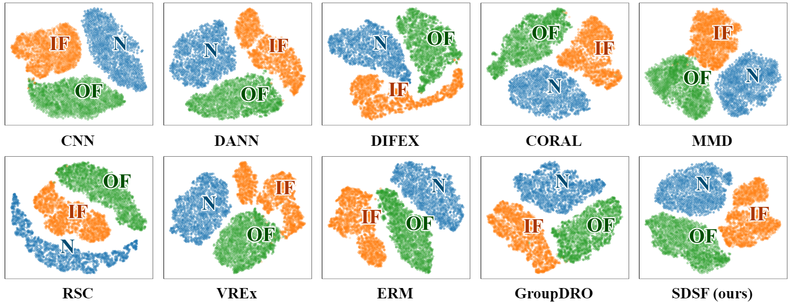
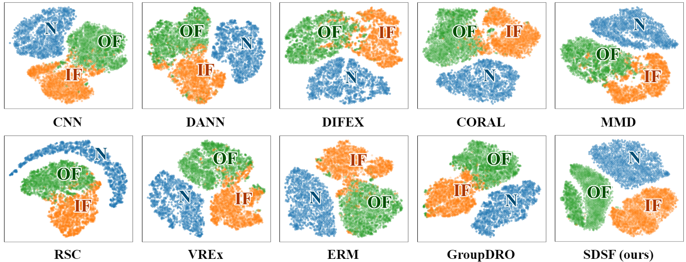
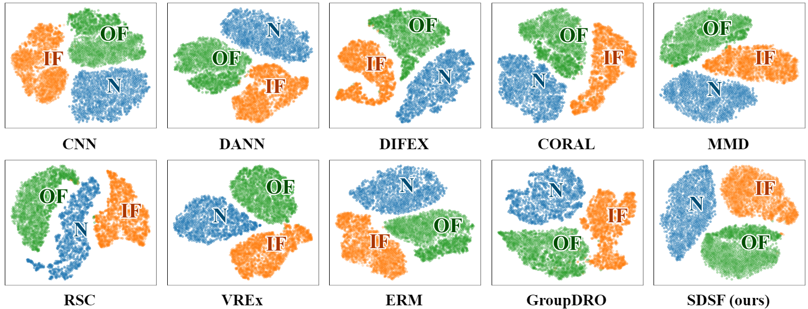
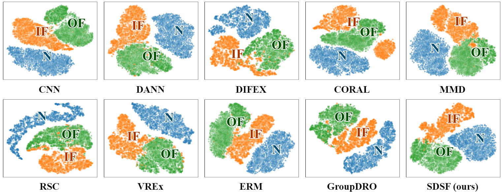
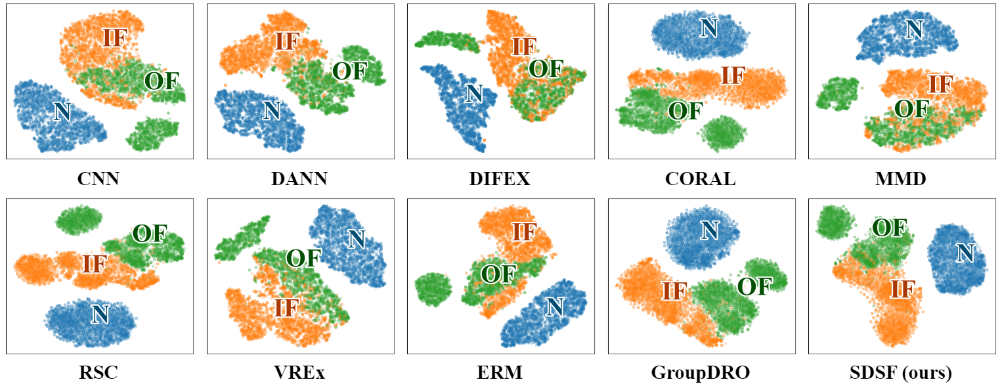
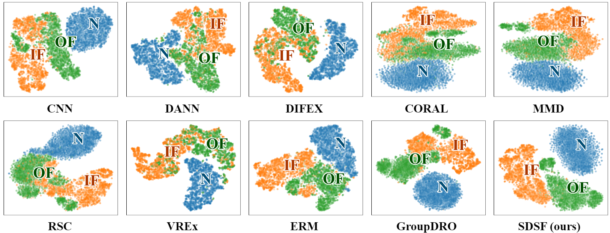
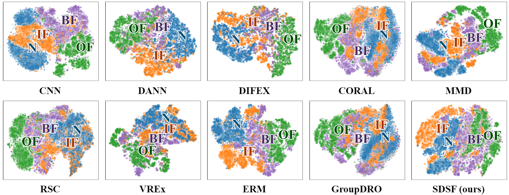
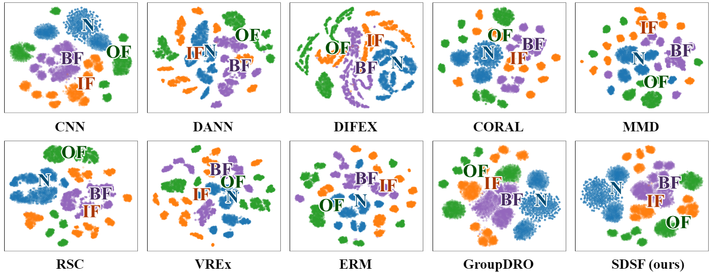

# SDSF
## 📚Paper 
#### Fault Diagnosis Under Unseen Conditions via Suppressing Domain-Sensitive Feature ####
## ⭐Code
The source code will be publicly released after paper accepted.
## 📦Dataset
Our experiments utilize four public datasets: Paderborn, MFPT, CWRU, and JNU.
## Visualization results 
``` T1 ```
<div style="text-align:center"></div>

``` T2 ```
<div style="text-align:center"></div>

``` T3 ```
<div style="text-align:center"></div>

``` T4 ```
<div style="text-align:center"></div>

``` T5 ```
<div style="text-align:center"></div>

``` T6 ```
<div style="text-align:center"></div>

``` T7 ```
<div style="text-align:center"></div>

``` T8 ```
<div style="text-align:center"></div>

## Confusion matrix results
``` T1 ```
<div style="text-align:center"></div>

``` T2 ```
<div style="text-align:center"></div>

``` T3 ```
<div style="text-align:center"></div>

``` T4 ```
<div style="text-align:center"></div>

``` T5 ```
<div style="text-align:center"></div>

``` T6 ```
<div style="text-align:center"></div>

``` T7 ```
<div style="text-align:center"></div>

``` T8 ```
<div style="text-align:center"></div>

